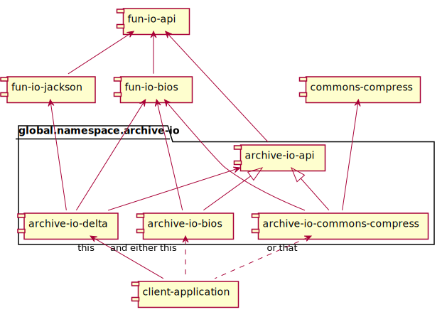

# Archive I/O [](http://search.maven.org/#search%7Cga%7C1%7Cg%3A%22global.namespace.archive-io%22) [](https://travis-ci.org/christian-schlichtherle/archive-io)

Archive I/O features diffing and patching of archive files like EAR, JAR, WAR, ZIP et al or directories.

## Features

+ An API for transparent access to archive files which is based on the API of [Fun I/O].
+ A facade for accessing JAR and ZIP files which depends on [Apache Commons Compress].
+ Another facade for accessing JAR and ZIP files which depends on the Java Runtime Environment (JRE) only.
+ A facade for diffing and patching archive files or directories.

## Usage

### Diffing two JAR files and generating a delta JAR file

The following code diffs two JAR files and generates a delta JAR file.
It uses the `Compress` facade to access the JAR files using Apache Commons Compress.
It also uses the `Delta` facade for the actual diffing:

```java
import java.io.File;

import static global.namespace.archive.io.commons.compress.CommonsCompress.*;
import static global.namespace.archive.io.delta.Delta.*;

File base = ...;
File update = ...;
File delta = ...;
diff().base(jar(base)).update(jar(update)).to(jar(delta));
```

If you wanted to use the `archive-io-bios` module instead of the `archive-io-commons-compress` module, then, apart from
configuring the class path, you would only have to edit the `import` statement as shown in the next example.

### Patching a JAR file with a delta JAR file to another JAR file

The following code patches a JAR file with a delta JAR file to another JAR file.
It uses the `BIOS` facade to access the JAR files using the JRE.
It also uses the `Delta` facade for the actual patching:

```java
import java.io.File;

import static global.namespace.archive.io.bios.BIOS.*;
import static global.namespace.archive.io.delta.Delta.*;

File base = ...;
File update = ...;
File delta = ...;
patch().base(jar(base)).delta(jar(delta)).to(jar(update));
```

### Diffing two directories and computing a delta model

Maybe you just want to examine the delta of two directories, but not generate a delta archive file or directory from 
that?
The following code diffs two directories and computes a delta model.
Again, the `Delta` and the `BIOS` facades can be used to do that:

```java
import java.io.File;

import global.namespace.archive.io.delta.model.*;

import static global.namespace.archive.io.bios.BIOS.*;
import static global.namespace.archive.io.delta.Delta.*;

File base = ...;
File update = ...;
DeltaModel model = diff().base(directory(base)).update(directory(update)).toModel();
```

The delta model has properties describing the changed, unchanged, added and removed entries.

## Module Structure

Archive I/O has a modular structure.
Its artifacts are hosted on Maven Central with the common group ID 
[`global.namespace.archive-io`](http://search.maven.org/#search%7Cga%7C1%7Cglobal.namespace.archive-io).
The following diagram shows the module structure:



The modules are:

+ `archive-io-api`: Provides an API for accessing archive files.
  The base package of this module is `global.namespace.archive.io.api`.
+ `archive-io-bios`: Implements the API and provides a facade for accessing directories, JAR and ZIP files.
  This module depends on packages of the JRE only (not shown).
  The base package of this module is `global.namespace.archive.io.bios`.
+ `archive-io-commons-compress`: Implements the API and provides a facade for accessing JAR and ZIP files.
  This module depends on Apache Commons Compress and provides best performance for diffing and patching.
  The base package of this module is `global.namespace.archive.io.commons.compress`.
+ `archive-io-delta`: Provides a facade for diffing and patching archive files or directories.
  The base package of this module is `global.namespace.archive.io.delta`.

Thus, for diffing and patching, your application needs to depend on the modules `archive-io-delta` and either
`archive-io-commons-compress` or `archive-io-bios`.

[Apache Commons Compress]: https://commons.apache.org/proper/commons-compress/
[Fun I/O]: https://github.com/christian-schlichtherle/fun-io
